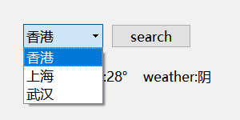
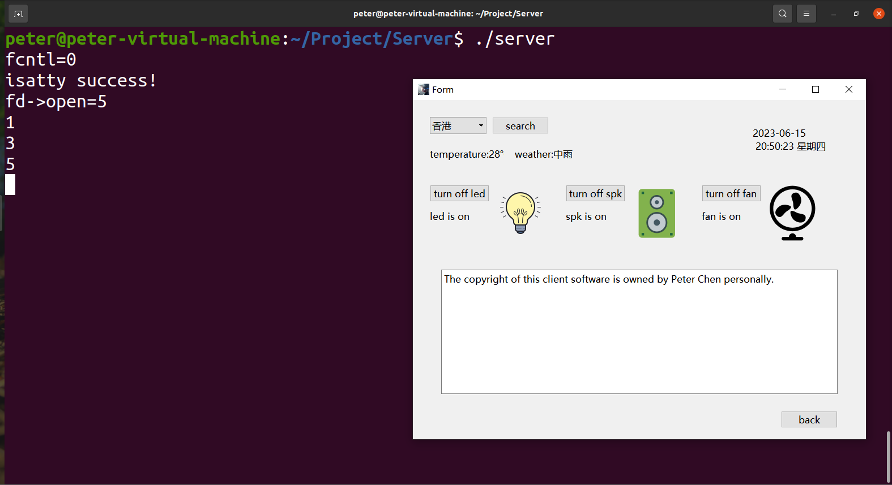

# Embedded_Smart_Home

## Software modules:

### 1.Client: a desktop client application based on Qt Creator, with functions including:

(1). To connect to the server in the LAN, you need to provide ipv4 and port

(2). Call the weather API to realize the function of weather query in different cities

(3). Call the header file library to display the real time

(4). Write a protocol to realize the LAN communication between the client and the server, and transmit the signals of the six functions of lights, buzzers, and fans on and off from the client to the server

### 2.Server: LAN server file written in C language, the functions include:

(1). Receive signals to control lights, buzzers, and fans to turn on and off the six functions transmitted through the written protocol

(2). Realize the serial port communication between the server and the development board through UART, and send the signals for turning on and off the three functions of the control lamp, buzzer and fan to the development board

## Hardware module:

Through the programming of STM32 single-chip microcomputer, the signal from the server to control the lights, buzzer, fan on and off six functions is received. Realize the six actual functions of controlling lights, buzzers, and fans to be turned on and off by three actual hardware

## Result photo:

### 1.Weather search function:

### 2.The effect display of the main interface of the client and the server terminal:

### 3.Development board effect display:

### Finally,realize the effect of embedded smart home